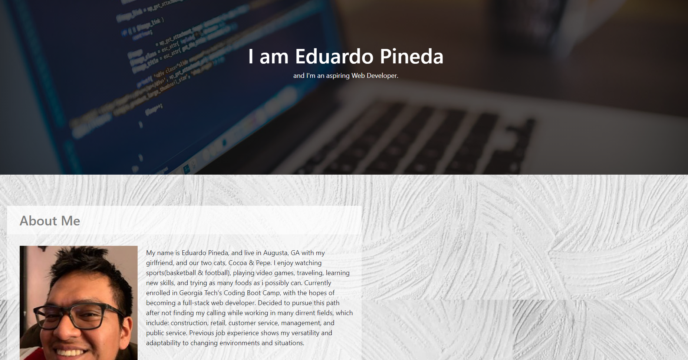
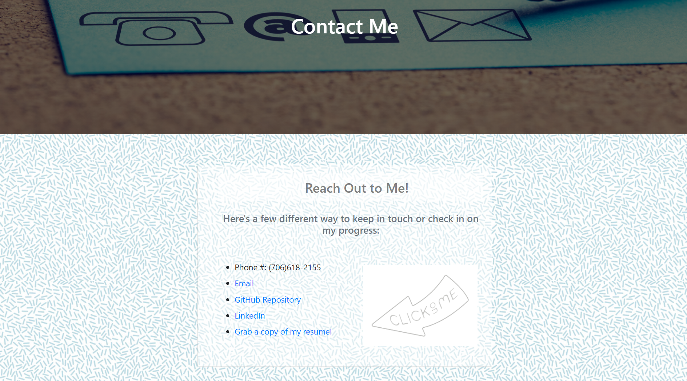
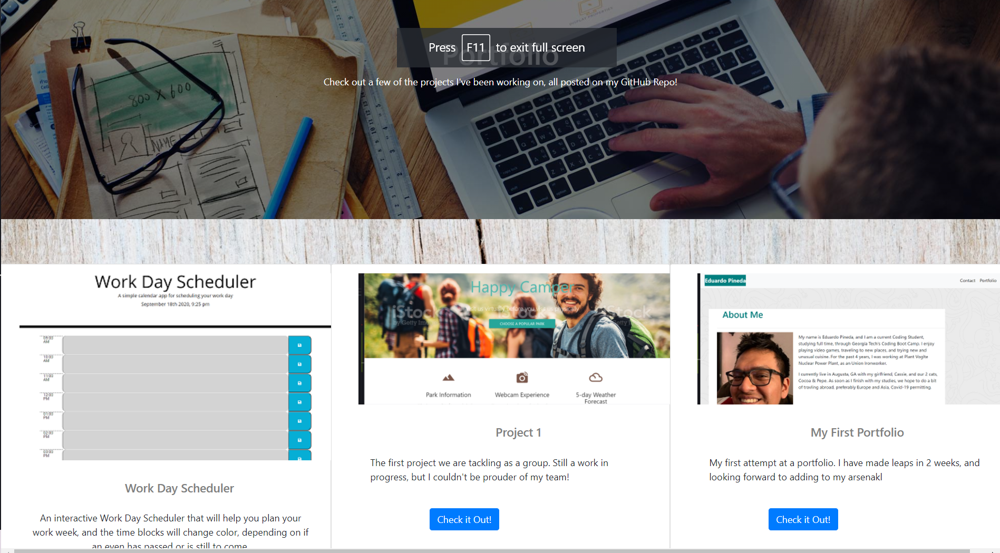

# Updated Portfolio

## Description

My Updated Portfolio, where I am able to showcase even more assignments, and now, 2 projects. The assignments showcased are the one I'm most proud of, and also have been betworking with my classmates and that will show in my updated LinkedIn and GitHub.

## Images

Below, screenshots of deployed site are provided

## Landing/About Me

This is the landing page where I provide a summary about myself, and what i hope to accomplish in the future.

## Contact Me

This is my contact page with has every possible way to get in touch with me, all with working links

## Portfolio

This updated portfolio show screenshots of some of my assignments, with title, description, and button that sends the user to the deployed link where they can be tested.

## Links

Email: edibozu@gmail.com

GitHub Repo: https://github.com/Edibozu/updated-portfolio

LinkedIn: https://www.linkedin.com/in/eduardo-pineda-5595431b6/

## License

MIT License

Copyright (c) [2020] [Eduardo Pineda]

Permission is hereby granted, free of charge, to any person obtaining a copy
of this software and associated documentation files (the "Software"), to deal
in the Software without restriction, including without limitation the rights
to use, copy, modify, merge, publish, distribute, sublicense, and/or sell
copies of the Software, and to permit persons to whom the Software is
furnished to do so, subject to the following conditions:

The above copyright notice and this permission notice shall be included in all
copies or substantial portions of the Software.

THE SOFTWARE IS PROVIDED "AS IS", WITHOUT WARRANTY OF ANY KIND, EXPRESS OR
IMPLIED, INCLUDING BUT NOT LIMITED TO THE WARRANTIES OF MERCHANTABILITY,
FITNESS FOR A PARTICULAR PURPOSE AND NONINFRINGEMENT. IN NO EVENT SHALL THE
AUTHORS OR COPYRIGHT HOLDERS BE LIABLE FOR ANY CLAIM, DAMAGES OR OTHER
LIABILITY, WHETHER IN AN ACTION OF CONTRACT, TORT OR OTHERWISE, ARISING FROM,
OUT OF OR IN CONNECTION WITH THE SOFTWARE OR THE USE OR OTHER DEALINGS IN THE
SOFTWARE.

